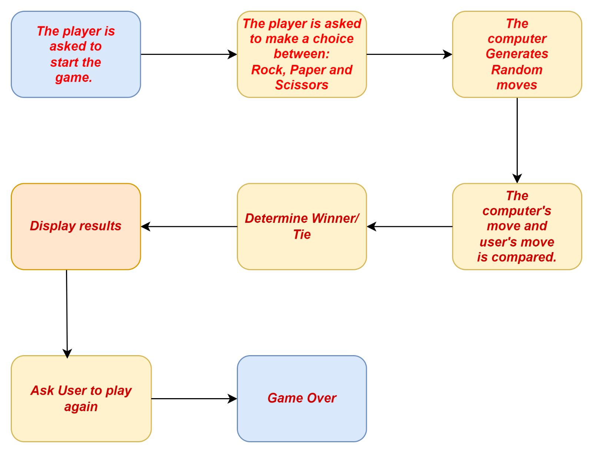

# Group-Lab
''''
The traditional "Rock paper and scissors" game was developed in Python.
The user must fight the computer in the game's single player mode.

The program prompts the user to choose between rock-paper-scissors options. 

Then the computer also randomly selects a selection for itself. The software will then decide who is the winner according to the rules of the game.

There are no complicated features or graphical user interfaces in this software.

August 5, 2023

'''' 

## Design 

## An algorithmic explanation of how the "Rock, Paper, Scissors" game works:
To get started, we need to define our three input/option possibilities:
"rock", "paper" and "scissors".

To make sure the game keeps running until the user decides otherwise, we need to add the variable "running" and set it to True.

To ensure that the game goes on until the player decides to finish, we also need to include a while loop and specify "running" as the condition.

The script uses the random.choice() method to generate a random option from "paper-scissors", "paper", and "scissors" for each iteration. Then display the message "Enter rock-paper-scissors or scissors:
" before asking the user to choose one of the three options and save their answer in the "player" variable.

The next step is to execute a nested while loop with the condition "while the player is not in the options" to determine if the input value is a valid option. Ask players to provide a legitimate option if their choice is incorrect until they do.

Compare the player's choice with the computer's (random) choice when it has made a legitimate choice.

The winner is then determined by comparing the player's and the computer's selections according to:

There will be a tie if the player and the machine both decide the same.
The player wins if he chooses "rock" and the computer chooses "scissors".
The player wins if he chooses "paper" while the computer chooses "rock". The player wins if he chooses "scissors" while the computer chooses "paper".
Otherwise, the computer wins.
After that, a message stating the result ("You win!") will be displayed.

Finally, it asks the user to play one more round by displaying the message "Do you want to play again? (y/n):
" message. Set "running" to False to complete the loop and print "You're a great player!" if the user decides to leave. 

## Participation
We are a group of two members. Jasmine is responsible for app developing and Andrew is a QA Tester. But it doesn't mean we didn't support one another. In other words, regardless of our real roles, we collaborated on this project as a team.
